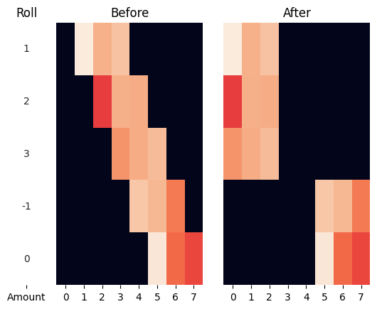

# Efficient row-specific rolling
An efficient implementation of a rolling operation for 2D and 3D arrays where data is rolled (shifted) along the second axis by a defined amount for each row.

## Example


## Requirements
```
scikit-image
numpy
```

tested on:
```
scikit-image==0.24.0
numpy==2.1.3
```